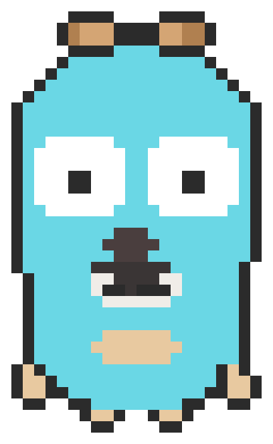

# Gopher Code

<p align="center">
  
</p>

<p align="center">
  <strong>Gopher Code, rewritten from scratch in Go. Zero Node.js. Zero Electron. One binary.</strong>
</p>

<p align="center">
  
</p>

<p align="center">
  <picture>
    <source media="(prefers-color-scheme: dark)" srcset="https://img.shields.io/badge/Go-1.24+-00ADD8?style=for-the-badge&logo=go&logoColor=white">
    
  </picture>
  
  
  
  
</p>

<p align="center">
  <strong>513K lines of TypeScript &rarr; clean, idiomatic Go.</strong><br>
  <sub>Starts in 12ms. No runtime dependencies. Cross-compiles everywhere Go does.</sub>
</p>

---

> [!IMPORTANT]
> **This is an active ground-up rewrite.** Gopher Code is not a wrapper, binding, or transpilation.
> Every subsystem of Claude Code v2.1.88 has been analyzed and rebuilt natively in Go using
> modern 2026 packages. See [Porting Status](#porting-status) for current progress.

---

## Why This Exists

An incredible tool trapped inside a 500K-line TypeScript monolith that ships
with Node.js, a bundled Ink/React renderer, native addons for every platform, and a `node_modules`
tree deeper than the Mariana Trench.

Gopher Code asks: **what if it was just a binary?**

- **12ms cold start** vs multi-second Node.js bootstrap
- **Single static binary** — `go build` and ship, no `npm install`, no native addons
- **Native concurrency** — goroutines for parallel tool execution, not Promise.all
- **Cross-compile in seconds** — `GOOS=linux GOARCH=arm64 go build` and done
- **Memory efficient** — no V8 heap, no garbage collector pauses from React re-renders
- **Hackable** — read the source in an afternoon, not a week

---

## Repository Layout

```text
gopher/
├── cmd/gopher/       # CLI entry point & REPL
│   └── main.go
├── pkg/                   # Core packages
│   ├── compact/           # Token budget & context compaction
│   ├── message/           # Message types & normalization
│   ├── mcp/               # Model Context Protocol client
│   ├── permissions/        # Tool permission evaluation
│   ├── prompt/            # System prompt assembly
│   ├── provider/          # Anthropic API provider (SSE streaming)
│   ├── query/             # Query loop orchestration
│   ├── session/           # Session state & persistence
│   └── tools/             # 33 built-in tools
├── internal/
│   ├── cli/               # Bubble Tea TUI renderer
│   └── testharness/       # Golden file test framework
├── testdata/              # Parity test fixtures
└── notes/                 # Architecture & dependency docs
```

---

## Porting Status

The rewrite is structured in phases, each building on the last:

| Phase | Subsystem | Status |
|-------|-----------|--------|
| 1 | Message types & normalization | **Done** |
| 2 | System prompt assembly | **Done** |
| 3 | Token budget & context compaction | **Done** |
| 4 | 33 built-in tools (Bash, Read, Edit, Write, Glob, Grep, Agent, ...) | **Done** |
| 5 | LLM API provider with SSE streaming | **Done** |
| 6 | Query loop orchestration (L1-L4 parity tests passing) | **Done** |
| 7 | CLI entry point & interactive REPL | **Done** |
| 8 | Session persistence & resume | **In Progress** |
| 9 | MCP client integration (stdio, SSE, WebSocket) | **In Progress** |
| 10 | Permission system & security analysis | **In Progress** |
| 11 | Charm v2 TUI (bubbletea, glamour, lipgloss) | **Planned** |
| 12 | Slash commands & skills | **Planned** |
| 13 | Git/GitHub integration | **Planned** |
| 14 | Subagent & task spawning | **Planned** |
| 15 | Observability & telemetry | **Planned** |

---

## Built With

Gopher Code is built on the modern 2026 Go ecosystem. No legacy. No baggage.

| Concern | Package | Why |
|---------|---------|-----|
| Terminal UI | `charm.land/bubbletea/v2` | Elm-architecture TUI |
| Styling | `charm.land/lipgloss/v2` | ANSI styling & layout |
| Markdown | `charm.land/glamour/v2` | Terminal markdown rendering |
| Components | `charm.land/bubbles/v2` | Spinner, viewport, text input, progress bar |
| Prompts | `charm.land/huh/v2` | Permission dialogs & interactive forms |
| Syntax HL | `github.com/alecthomas/chroma/v2` | Code highlighting in terminal output |
| API streaming | `github.com/tmaxmax/go-sse` | Server-Sent Events for LLM API |
| HTTP | `github.com/hashicorp/go-retryablehttp` | Resilient HTTP with exponential backoff |
| MCP | `github.com/mark3labs/mcp-go` | Model Context Protocol client SDK |
| Shell parsing | `mvdan.cc/sh/v3` | Bash AST for security analysis |
| Glob | `github.com/bmatcuk/doublestar/v4` | `**` pattern support |
| Git | `github.com/go-git/go-git/v5` | Pure Go git operations |
| GitHub | `github.com/google/go-github/v84` | GitHub API v84 |
| Config | `github.com/knadh/koanf/v2` | Multi-source configuration |
| Schema | `github.com/santhosh-tekuri/jsonschema/v6` | Tool input validation |
| Concurrency | `golang.org/x/sync` | errgroup + semaphore for parallel tools |
| Caching | `github.com/hashicorp/golang-lru/v2` | File state LRU cache |
| Keyring | `github.com/zalando/go-keyring` | OS-native credential storage |
| Observability | `go.opentelemetry.io/otel` | Traces, metrics, spans |

---

## Quickstart

```bash
# Clone
git clone https://github.com/projectbarks/gopher.git
cd gopher

# Build
go build -o gopher ./cmd/gopher

# Run interactive REPL
./gopher

# Run headless
./gopher -p "explain this codebase"

# Cross-compile for Linux ARM64
GOOS=linux GOARCH=arm64 go build -o gopher-linux-arm64 ./cmd/gopher
```

### CLI Flags

```text
Usage: gopher-code [flags]

Flags:
  -p, --print string     Run a single query in headless mode
  -m, --model string     Model to use (default: claude-sonnet-4-20250514)
  -c, --cwd string       Working directory
  -r, --resume string    Resume a previous session by ID
  -o, --output string    Output format: text, json, stream-json
  -v, --verbose          Enable verbose logging
```

---

## Architecture

Gopher Code mirrors the subsystem architecture of Claude Code while leveraging Go's strengths:

```text
                    ┌─────────────────────────┐
                    │     CLI / Bubble Tea     │
                    │    (cmd/gopher-code)     │
                    └────────────┬────────────┘
                                 │
                    ┌────────────▼────────────┐
                    │      Query Engine        │
                    │     (pkg/query)          │
                    └──┬──────────┬──────────┬┘
                       │          │          │
              ┌────────▼───┐ ┌───▼────┐ ┌───▼────────┐
              │  Provider   │ │ Tools  │ │  Session   │
              │ (Anthropic) │ │ (x33)  │ │ (persist)  │
              └──────┬─────┘ └───┬────┘ └────────────┘
                     │           │
              ┌──────▼─────┐ ┌───▼────────────┐
              │ SSE Stream │ │  Permissions    │
              └────────────┘ │  Shell Parse    │
                             │  MCP Client     │
                             └────────────────┘
```

**Key design decisions:**

- **No global state** — all state flows through explicit function parameters and the session store
- **Context-first cancellation** — every goroutine respects `context.Context`
- **Interfaces at boundaries** — provider, tools, and transport are all interface-based for testing
- **Golden file tests** — parity tests run against captured Claude Code v2 transcripts

---

## Current Parity Checkpoint

Gopher Code passes **L1-L4 parity tests** against Claude Code v2.1.88:

- **L1** — Message normalization round-trips match TypeScript output
- **L2** — System prompt assembly produces identical prompts
- **L3** — Tool input/output schemas match the API contract
- **L4** — Multi-turn query loops produce equivalent tool call sequences

The parity test suite uses golden files captured from the TypeScript implementation to ensure
behavioral equivalence, not just structural similarity.

---

## Contributing

This is a research project exploring what a native Go implementation of an agentic coding
assistant looks like. Contributions, ideas, and feedback are welcome.

```bash
# Run tests
go test ./...

# Run with race detector
go test -race ./...

# Update golden files
go test ./... -update
```

---

<p align="center">
  <sub>Built by <a href="https://github.com/projectbarks">@projectbarks</a></sub><br>
  <sub>Gopher Code is an independent project. Not affiliated with Anthropic.</sub>
</p>
